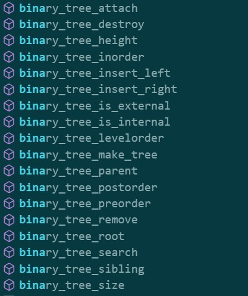
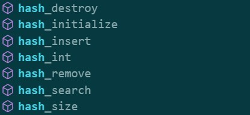
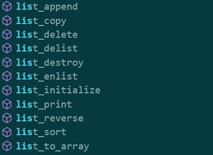
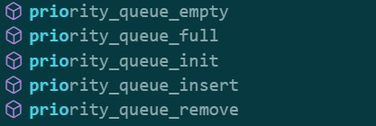
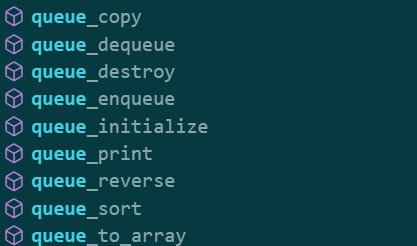
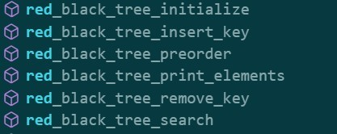
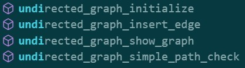

# Every **function available** to a **user**

## **Arrays**
 

## **BinaryTrees**

## **HashTables**

## **Lists**

## **PriorityQueues**

## **Queues**

## **RedBlackTrees** 

## **Stacks**

## **UndirectedGraphs**
